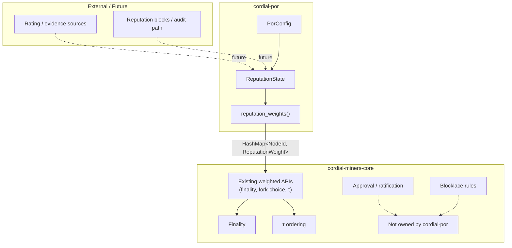
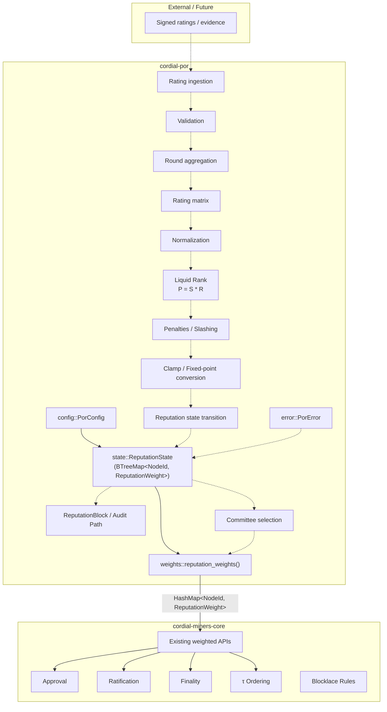

# cordial-por Architecture

## Purpose

`cordial-por` is the dedicated crate for Proof-of-Reputation (PoR) state, reputation-derived weights, and (future) audit data that feed the weighted path of Cordial Miners.

Cordial Miners approval, ratification, finality, τ-ordering and blocklace consensus rules remain exclusively inside `cordial-miners-core`.
`cordial-por` computes and exports weights only; it never implements consensus.

## Design Goals

- Keep reputation state and weight export behind a clean crate boundary.
- Supply `HashMap<NodeId, u64>` (aliased as `ReputationWeight`) that the existing weighted APIs of `cordial-miners-core` can consume without modification.
- Remain a pure library; no networking, no block production, no finality logic.
- Provide a stable scaffold that later PoR stages (alpha blending, penalties, reputation blocks, etc.) can be added to without changing the integration contract.

## High-Level Architecture



## Internal PoR Architecture

The current crate is an intentional scaffold. The implemented modules remain intentionally small, while the complete future Proof-of-Reputation pipeline is shown as dotted stages to document the intended evolution of the crate.



### Implemented And Future PoR Stages

> **Implementation Note:**  
> The stages shown with dotted edges in the architecture above are part of the intended PoR architecture described in the paper (arXiv:2108.03542 and related Liquid-Rank literature). The current crate implements the data-preparation path through normalized rating matrices plus the first Liquid-Rank contribution calculation `P = S * R`; alpha blending and reputation-state updates remain future work.

- Rating validation and deterministic round batching
- Rating matrix construction
- Paper-guided rating normalization
- Liquid-Rank contribution calculation
- Penalties / slashing
- Clamping / fixed-point conversion (beyond the scale constant already present)
- Reputation state transition
- Reputation block / audit path
- Committee selection

## Module Responsibilities

| Module | Responsibility | Inputs | Outputs | Dependencies | Public interfaces |
|--------|----------------|--------|---------|--------------|-------------------|
| `config` | Holds fixed-point scale and initial reputation | scale, initial value | `PorConfig` | none | `PorConfig::{new, default}` |
| `types` | Deterministic PoR data model | — | ratings, matrices, reputation entries, blocks | `cordial-miners-core::NodeId` | re-exported types |
| `ratings` | Validate signed rating records and build deterministic round batches | `RatingRecord`, `PorConfig` | `RatingBatch` | `config`, `types`, `error` | `validate_rating`, `build_rating_batch` |
| `matrix` | Build canonical matrix representation from validated batches | `RatingBatch` | `RatingMatrix` | `types`, `error` | `build_rating_matrix` |
| `normalization` | Apply Section 4.2 modified normalization per recipient row | `RatingMatrix`, `PorConfig` | `NormalizedRatingMatrix` | `config`, `types`, `error` | `normalize_rating_matrix` |
| `liquid_rank` | Compute paper-guided contribution vector `P = S * R` | `NormalizedRatingMatrix`, previous `ReputationVector`, `PorConfig` | contribution `ReputationVector` | `config`, `types`, `error` | `compute_liquid_rank_contribution` |
| `state` | In-memory reputation map keyed by `NodeId` | round, validator → weight | `ReputationState` | `types` | `new`, `round`, `reputations`, `reputation_of`, `set_reputation` |
| `weights` | Export current reputation map for the weighted path | `&ReputationState` | `HashMap<NodeId, ReputationWeight>` | `state`, `cordial-miners-core::NodeId` | `reputation_weights` |
| `error` | PoR validation, matrix, normalization, and calculation errors | — | `PorError` | none | `PorError` variants |
| `lib` | Crate root, re-exports | — | public API surface | all of the above | `PorConfig`, `PorError`, `ReputationState`, rating/matrix APIs, types, `reputation_weights` |

## Data Flow

1. A `PorConfig` is created (defaults: scale = `1_000_000_000`, initial_reputation = `200_000_000`).
2. Rating records are validated and batched with `build_rating_batch`.
3. A deterministic `RatingMatrix` is built with `build_rating_matrix`.
4. The matrix is normalized per recipient with `normalize_rating_matrix`.
5. The Liquid-Rank contribution vector is computed with `compute_liquid_rank_contribution`.
6. A `ReputationState` can still be instantiated and exported through `reputation_weights(&state)` for Cordial Miners weighted APIs.
7. No further processing (finality, τ, approval) occurs inside `cordial-por`.

## Ownership Boundaries

### cordial-por owns

- Reputation state representation (`ReputationState`).
- Fixed-point scale and initial-reputation configuration.
- Rating validation, deterministic matrix construction, paper-guided rating normalization, and Liquid-Rank contribution calculation.
- Conversion of the current reputation map into the weight map expected by Cordial Miners.
- Future PoR algorithms (alpha blending, penalties, reputation blocks) once implemented.

### cordial-por does NOT own

- Approval mechanics
- Ratification
- Finality detection
- τ ordering
- Blocklace consensus rules
- Equivocation detection / exclusion
- Networking or block production

## Integration Contract

**Current implemented interface**

```rust
pub fn reputation_weights(state: &ReputationState) -> HashMap<NodeId, ReputationWeight>
```

where `ReputationWeight = u64` and `NodeId` is the type defined by `cordial-miners-core`.

**Intended integration contract** (already satisfied by the current function)

- `cordial-por` exports `HashMap<NodeId, u64>`.
- `cordial-miners-core` consumes those weights through its existing weighted APIs (finality stake summation, fork-choice scoring, etc.).
- No consensus behaviour is altered; weights are only an input parameter.
- Refresh / update lifecycle is currently caller-driven (`set_reputation` + re-export). Persistence ownership remains outside the crate.
- Adapter layer is trivial: the returned map is already in the form expected by the weighted path.

## Relationship with Cordial Miners Consensus

`cordial-por` computes weights.

It does **not** implement:

- consensus
- approval
- ratification
- τ ordering
- finality
- blocklace rules

All of the above remain the exclusive responsibility of `cordial-miners-core`. The only coupling is the consumption of the weight map.

## Open Design Decisions

### All-validator reputation weights vs committee weights

- **Current implementation:** All validators present in `ReputationState` are exported.
- **Paper design:** Highest-reputation nodes form a consensus committee.
- **Future work:** Policy flag (reputation-only / committee-only / stake × reputation) inside the weight exporter.

### >2/3 finality threshold vs >50% committee threshold

- **Current implementation:** Threshold logic lives entirely in `cordial-miners-core` (supermajority of honest stake).
- **Paper design:** Committee of high-reputation nodes may use a lower internal threshold.
- **Future work:** Decide whether PoR only supplies weights or also influences the threshold constant.

### Fixed-point scale

- **Current implementation:** `PorConfig::DEFAULT_SCALE = 1_000_000_000`.
- **Paper design:** Liquid Rank produces real-valued ranks that must be scaled for integer arithmetic.
- **Future work:** Confirm clamping rules and overflow behaviour for the final reputation transition.

### Reputation sidechain vs payload references

- **Current implementation:** No reputation blocks or sidechain.
- **Paper design:** Reputation updates may be carried as a sidechain or as payload references inside the main blocklace.
- **Future work:** Choose the audit / publication path and the corresponding data structures.

## Future Extensions

Logical extension points that do not yet exist:

- Alpha blending and final reputation transition after the `P = S * R` contribution step.
- Penalty / slashing application that mutates `ReputationState`.
- Reputation-block construction and audit trail.
- Committee selection policy that filters the exported weight map.
- Persistence layer (snapshot / restore of `ReputationState`).
- Configuration-driven weight policies (reputation-only, stake-times-reputation, capped stake, committee-only).

None of the above are present in the current scaffold; they are documented solely as planned extension points.
