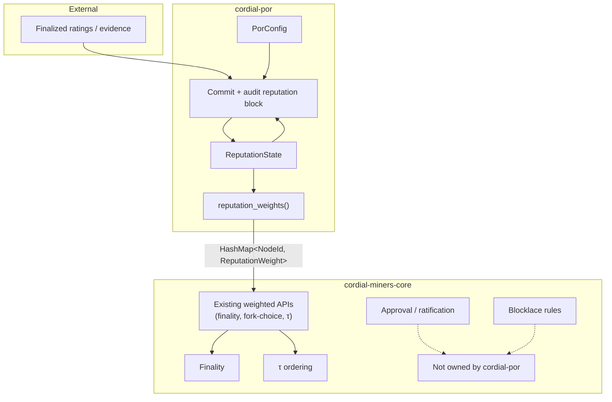
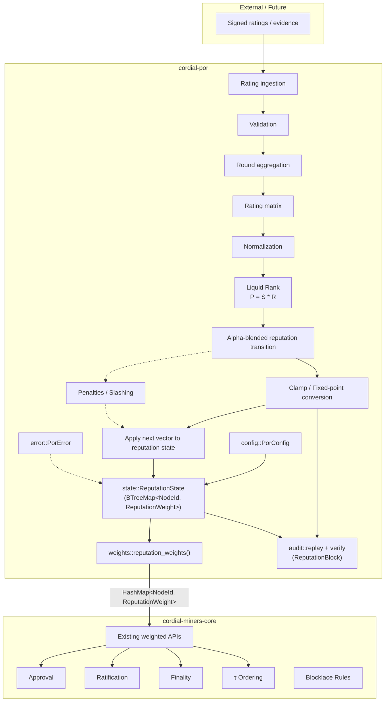

# cordial-por Architecture

## Purpose

`cordial-por` is the dedicated crate for Proof-of-Reputation (PoR) state, deterministic transition audit, and reputation-derived weights that feed the weighted path of Cordial Miners.

Cordial Miners approval, ratification, finality, τ-ordering and blocklace consensus rules remain exclusively inside `cordial-miners-core`.
`cordial-por` computes and exports weights only; it never implements consensus.

## Design Goals

- Keep reputation state and weight export behind a clean crate boundary.
- Supply `HashMap<NodeId, u64>` (aliased as `ReputationWeight`) that the existing weighted APIs of `cordial-miners-core` can consume without modification.
- Remain a pure library; no networking, no block production, no finality logic.
- Provide a stable scaffold for PoR calculation stages while keeping state mutation and publication separate from Cordial membership and consensus.

## Related Specifications

- [`data-structures.md`](./data-structures.md): paper-aligned PoR data structures and calculation pipeline.
- [`01-tiered-slashing-and-key-ejection.md`](./01-tiered-slashing-and-key-ejection.md): slashing, inactivity, and permanent key ejection policy.
- [`02-interaction-model-and-rating-policy.md`](./02-interaction-model-and-rating-policy.md): interaction model and rating admission policy.

## High-Level Architecture



## Internal PoR Architecture

The crate implements the deterministic rating-to-reputation path. Cordial Miners remains authoritative for validator membership, leaders, finality, and ordering; PoR supplies weights only.



### Implemented And Future PoR Stages

> **Implementation Note:**  
> The solid edges are implemented. Dotted edges are optional weight-engine extensions. The transition requires consecutive rounds and resolves sparse node sets through a configured no-rating fallback policy. Reputation-block construction derives canonical commitments and audit replay verifies them. The adapter retains crash-safe history and can collect optional signed checkpoint attestations, but those attestations do not decide Cordial finality or weight activation. Runtime activation projects PoR values onto Cordial's existing authorized validator set.

Implemented:

- Rating validation and deterministic round batching
- Rating matrix construction
- Paper-guided rating normalization
- Liquid-Rank contribution calculation
- Alpha-blended reputation transition
- Deterministic sigmoid clamping
- Reputation state application
- Versioned reputation-block construction and canonical commitments
- Reputation transition and commitment audit replay
- Bounded, versioned reputation-block wire encoding
- Crash-safe reputation-state snapshots and append-only block history
- Signed, versioned reputation-block publications with a bounded adapter channel
- Optional weighted checkpoint attestation with durable replay audit

Future:

- Penalties / slashing
- Concrete peer-network binding
- Durable checkpoint-attestation retention

## Module Responsibilities

| Module | Responsibility | Inputs | Outputs | Dependencies | Public interfaces |
|--------|----------------|--------|---------|--------------|-------------------|
| `config` | Holds fixed-point scale, initial reputation, and the no-rating fallback policy | scale, initial value, policy | `PorConfig`, `MissingEntryPolicy` | `types` | `PorConfig::{new, default}`, `MissingEntryPolicy` |
| `types` | Deterministic PoR data model | — | ratings, matrices, reputation entries, blocks | `cordial-miners-core::NodeId` | re-exported types |
| `ratings` | Validate signed rating records and build deterministic round batches | `RatingRecord`, `PorConfig` | `RatingBatch` | `config`, `types`, `error` | `validate_rating`, `build_rating_batch` |
| `matrix` | Build canonical matrix representation from validated batches | `RatingBatch` | `RatingMatrix` | `types`, `error` | `build_rating_matrix` |
| `normalization` | Apply Section 4.2 modified normalization per recipient row | `RatingMatrix`, `PorConfig` | `NormalizedRatingMatrix` | `config`, `types`, `error` | `normalize_rating_matrix` |
| `liquid_rank` | Compute paper-guided contribution vector `P = S * R` | `NormalizedRatingMatrix`, previous `ReputationVector`, `PorConfig` | contribution `ReputationVector` | `config`, `types`, `error` | `compute_liquid_rank_contribution` |
| `transition` | Blend contribution with previous reputation using checked fixed-point arithmetic and consecutive rounds, resolving sparse node sets through the configured policy | contribution `ReputationVector`, previous `ReputationVector`, `PorConfig` | next-round `ReputationVector` | `config`, `types`, `error` | `blend_reputation_transition` |
| `clamp` | Apply deterministic fixed-point sigmoid clamp to reputation values; the pipeline clamp restores CarryForward entries from previous reputation so an already-finalized value is not decayed and a hand-built blend cannot preserve an arbitrary unclamped value | `ReputationVector`, previous and contribution vectors, `PorConfig` | clamped `ReputationVector` | `config`, `types`, `error` | `clamp_reputation_value`, `clamp_reputation_vector`, `clamp_reputation_transition` |
| `state` | In-memory reputation snapshot keyed by `NodeId`; consumes finalized vectors or audited blocks atomically | round, validator → weight, finalized `ReputationVector` or ratings + `ReputationBlock` | `ReputationState` | `audit`, `config`, `types`, `error` | `new`, `round`, `reputation_list`, `pending_ratings`, `latest_block`, `add_rating`, `set_reputation`, `eject_validator`, `is_ejected`, `excluded_keys`, `apply_reputation_vector`, `apply_reputation_block` |
| `commitments` | Define the canonical, domain-separated v1 commitments for configuration, signed ratings, reputation lists, and reputation blocks | protocol data | Blake2b-256 commitments | `config`, `ratings`, `types`, `error` | `config_commitment`, `rating_batch_commitment`, `reputation_list_commitment`, `reputation_block_hash` |
| `block` | Derive, validate, and canonically encode a versioned, shard-bound, finalized-wave-bound reputation block | `ReputationBlockContext`, `RatingBatch`, `ReputationList`, `PorConfig` / wire bytes | `ReputationBlock` / bounded wire envelope | `commitments`, `ratings`, `types`, `error` | `build_reputation_block`, `validate_reputation_block`, `encode_reputation_block`, `decode_reputation_block` |
| `audit` | Replay the deterministic transition and verify it, its commitments, and its chain context against a proposed reputation block | previous `ReputationVector`, `&[RatingRecord]`, `ReputationBlock`, `ReputationBlockContext`, `PorConfig` | expected `ReputationList` / verification result | `commitments`, `ratings`, `matrix`, `normalization`, `liquid_rank`, `transition`, `clamp`, `block`, `types`, `error` | `replay_reputation_transition`, `verify_reputation_transition` |
| `snapshot` | Encode and validate the complete finalized state in a bounded, versioned, checksummed durable format | `ReputationState` / snapshot bytes | snapshot bytes / restored `ReputationState` | `state`, `block`, `commitments`, `types`, `error` | `encode_reputation_state_snapshot`, `decode_reputation_state_snapshot` |
| `weights` | Export current reputation map for the weighted path | `&ReputationState` | `HashMap<NodeId, ReputationWeight>` | `state`, `cordial-miners-core::NodeId` | `reputation_weights` |
| `error` | PoR validation, matrix, normalization, and calculation errors | — | `PorError` | none | `PorError` variants |
| `lib` | Crate root, re-exports | — | public API surface | all of the above | `PorConfig`, `PorError`, `ReputationState`, rating/matrix/liquid-rank/transition/block APIs, types, `reputation_weights` |

## Data Flow

1. A `PorConfig` is created (defaults: scale = `1_000_000_000`, initial_reputation = `200_000_000`).
2. Rating records are validated and batched with `build_rating_batch`.
3. A deterministic `RatingMatrix` is built with `build_rating_matrix`.
4. The matrix is normalized per recipient with `normalize_rating_matrix`.
5. The Liquid-Rank contribution vector is computed with `compute_liquid_rank_contribution`.
6. The next vector is computed with `blend_reputation_transition`, which requires consecutive rounds and covers the union of both node sets, resolving nodes missing from either side through `PorConfig::missing_entry_policy`; this is a pure calculation and does not mutate state.
7. The next vector is clamped with `clamp_reputation_transition`, which applies the sigmoid to rated and newly seeded nodes and restores CarryForward entries from previous reputation. The previous value is copied rather than taken from the blend, so a hand-built blended vector cannot preserve an arbitrary unclamped value. The sigmoid is not idempotent, so clamping those entries would decay them every sparse round. This is a pure calculation and does not mutate state.
8. A finalized vector can be applied directly with `ReputationState::apply_reputation_vector`, or a proposed block can be replay-audited and applied atomically with `ReputationState::apply_reputation_block`. Successful block application also records `latest_block`; failure leaves the prior state unchanged.
9. A `ReputationBlock` is assembled with `build_reputation_block`. The builder accepts finalized protocol inputs rather than caller-supplied hashes and derives the canonical configuration, signed-rating, reputation-list, and previous-block commitments. The v1 header binds the result to a shard and to the finalized wave that opens its reputation round.
10. Any validator can replay steps 2-7 with `replay_reputation_transition` and check a proposed block with `verify_reputation_transition`. Verification checks the header version, shard, source wave, previous-block link, all derived commitments, exclusion flags, and the replayed reputation list. Both operations are read-only.
11. The f1r3node adapter consumes a deterministically closed rating round, constructs and audits its reputation block against a cloned state, exports `reputation_weights`, and produces a staged next state without changing the live state.
12. A committed `ReputationBlock` can be encoded into or decoded from the canonical bounded v1 block envelope. The durable snapshot embeds the same block payload.
13. `DurablePorState` commits the complete staged snapshot, appends the same block envelope to immutable round history, and only then exposes the state in memory. Startup validates the retained chain and completes a missing tip from the snapshot after an interrupted append.
14. The adapter wraps a canonical block envelope with a version, publisher public key, and secp256k1 signature, then exposes broadcaster/receiver traits and a bounded Tokio handoff.
15. Optional checkpoint publications are matched against Cordial-supplied authorized attesters, replay-audited against the local completed rating round, deduplicated, and summarized by a strict configurable attestation threshold. This threshold is not Cordial finality.
16. `DurablePorState::apply_attested_checkpoint` re-audits the checkpoint against current state and context before using the snapshot-first, history-second commit sequence.
17. `authorized_validator_weights` projects the committed PoR state onto Cordial's existing validator identities, and `LiveIngress::apply_por_weights` activates the values only after source-wave and finalized-prefix safety checks.
18. Concrete peer-network binding and durable attestation retention remain future stages.

## Adapter Finalization Boundary

`PorRatingRoundCoordinator::into_completed` converts a closed lifecycle coordinator into an owned `CompletedPorRatingRound`. Open coordinators are rejected, so this handoff cannot bypass quorum or the finalized-wave cutoff. Owning the result also releases the coordinator's immutable borrow of the previous reputation state.

The adapter's `apply_completed_reputation_round` function then performs the complete local transition:

```text
Completed RatingBatch
  -> deterministic replay
  -> ReputationBlock construction
  -> audit replay
  -> ReputationState application
  -> Cordial weight export
```

The transition is atomic with respect to `ReputationState`: all work is staged on a clone and the caller's state is replaced only on success. Its external chain input is the shard identifier. The finalized source wave and canonical rating batch come from `CompletedPorRatingRound`, while the previous reputation block comes from `ReputationState::latest_block`. `cordial-por` derives every commitment internally, so the adapter cannot inject opaque commitment bytes.

## Adapter Persistence Boundary

`cordial-por::snapshot` owns the v1 durable encoding, size bounds, checksum, and restored-state invariants. It performs no filesystem I/O. The adapter's `por::persistence::PorStateStore` owns the node data-directory layout:

```text
<data_dir>/por/
  reputation-state.bin
  reputation-blocks/
    reputation-block-{round as 20 decimal digits}.bin
```

`PorStateStore::persist` validates and encodes before changing the filesystem, writes and syncs a temporary file, atomically renames it over the committed snapshot, and syncs the directory. An interrupted write therefore leaves the previous committed file available. `restore` returns `None` only when the committed file is absent; corruption, truncation, unsupported versions, and oversized files are startup errors rather than silent first boots.

`por::history::PorReputationBlockHistory` stores the canonical publication
envelope for every retained round. It syncs a temporary file, creates the final
path without replacement, removes the temporary name, and syncs the directory.
Recovery decodes every retained file and validates its filename round,
consecutive order, shard, and previous-block hash. Corruption, gaps, conflicting
rounds, and broken links fail closed.

The snapshot contains finalized state only. A state with pending ratings is rejected instead of silently discarding in-flight work. `DurablePorState` connects the store to startup, local completed-round application, and admitted peer-block application:

```text
startup
  -> restore committed snapshot
  -> or validate and persist initial state

local completed round
  -> stage and audit next state
  -> persist and sync complete snapshot
  -> append and sync immutable reputation block
  -> replace live in-memory state

quorum-admitted peer block
  -> re-audit against current state and completed ratings
  -> persist and sync complete snapshot
  -> append and sync immutable reputation block
  -> replace live in-memory state
```

An existing snapshot always wins over the supplied startup fallback. Invalid
snapshots or histories fail startup. Transition errors occur before storage and
leave the owner usable. The snapshot is intentionally committed before its
history entry. If that second write is interrupted, startup appends the
snapshot's latest audited block when it is the valid next history block. An
empty history can likewise start from the latest snapshot as an upgrade
checkpoint. All other state/history divergence is rejected. Any storage error
leaves the old in-memory state unpublished and returns `RecoveryRequired`
until the process reopens and reconciles the stores.

## Adapter Publication Boundary

The adapter's `por::transport::reputation_block` module owns the signed outer
publication envelope. It signs the Blake2b-256 hash of the domain, publication
version, publisher key, and exact canonical block envelope. The publisher key
is a compressed or uncompressed secp256k1 public key, and signatures use the
existing DER-encoded secp256k1 scheme. All fields and the complete message have
explicit size limits.

Outbound code can sign and broadcast in one operation or retain an authenticated
`ReputationBlockPublicationV1` and retry the same bytes. Inbound decoding
checks framing, the inner block checksum and structure, and the publisher
signature before returning a proposal. Private fields prevent safe code from
changing the authenticated publisher, block, or signature after verification.

The `por::transport::reputation_block_channel` module provides a bounded Tokio
handoff with non-blocking sends and explicit `Full` and `Closed` failures.
It is a process-local adapter seam, not a peer protocol. A concrete gRPC or
peer-gossip implementation can implement the broadcaster trait or feed this
channel without coupling network code to PoR calculation.

Authentication answers only “which key published these exact bytes.” It does
not establish Cordial finality or validator authority, replay the ratings,
validate the expected shard or previous block, persist the block, or activate
weights. Optional checkpoint attestation and durable replay remain separate
adapter boundaries.

## Adapter Checkpoint Attestation Boundary

`por::checkpoint::PorCheckpointCollector` optionally aggregates authenticated
confirmations that authorized Cordial validators calculated the same
reputation checkpoint. Cordial supplies the attester identities from its
existing validator set; PoR never selects a committee or changes membership.
The collector snapshots preceding-state reputation values only to summarize
attestation weight. Its default threshold is strictly greater than two thirds:
`floor(W * n / d) + 1`. This is an operational checkpoint-confidence policy,
not a finality rule and not a prerequisite for local deterministic weight
calculation.

Each publication is replay-audited against the local
`CompletedPorRatingRound`, previous state, configuration, shard, source wave,
and previous block before it counts. Duplicates are idempotent. Conflicting
blocks signed by one attester return both authenticated publications as
evidence while retaining the first confirmation.

Once the threshold is reached, `into_attested` produces an
`AttestedPorCheckpoint` with private fields, the audited block, ordered signed
publications, and attestation progress.
`DurablePorState::apply_attested_checkpoint` replays the deterministic
transition again before filesystem writes. The signatures cannot override a
local replay failure and do not authorize Cordial finality or weight
activation. Successful replay uses the same crash-safe
snapshot-first/history-second sequence as a locally constructed block.

## Runtime Weight-Engine Boundary

`cordial_por::authorized_validator_weights` takes validator identities from
Cordial and projects reputation values onto exactly that set. Extra PoR entries
are ignored, missing Cordial validators fail closed, duplicate inputs are
deduplicated, ejected identities remain present with zero weight, and a
zero-total result is rejected. PoR therefore changes values, never membership.

`LiveIngress::apply_por_weights` is the runtime activation point. It:

1. derives authorized identities from the current Cordial bonds map;
2. builds the complete projected map before mutation;
3. rejects non-genesis PoR state without an audited checkpoint and verifies
   that checkpoint's source wave is covered by published Cordial finality;
4. prospectively recomputes weighted ordering and rejects an update that would
   rewrite the published finalized prefix; and
5. atomically replaces weights and clears the ordering cache.

This preserves the one-round delay: interactions finalized in wave `k` produce
PoR round `k + 1`, whose weights can affect only subsequent Cordial decisions.

## Ownership Boundaries

### cordial-por owns

- Reputation state representation (`ReputationState`).
- Fixed-point scale and initial-reputation configuration.
- Rating validation, deterministic matrix construction, paper-guided rating normalization, Liquid-Rank contribution calculation, pure alpha-blend transition calculation with a configured no-rating fallback, deterministic sigmoid clamping (restoring CarryForward entries from previous reputation so finalized reputation is not decayed on a sparse round), explicit finalized-vector application, canonical reputation commitments, atomic audited-block application to `ReputationState`, reputation-block construction and validation, and deterministic audit replay of a proposed reputation block.
- Versioned durable-state bytes and validation for `ReputationState`, its permanent ejection registry, and latest audited block.
- Raw reputation export and fail-closed projection onto Cordial-supplied validator identities.
- Future deterministic penalty calculations, without assuming consensus ownership.

### cordial-por does NOT own

- Approval mechanics
- Ratification
- Finality detection
- τ ordering
- Blocklace consensus rules
- Equivocation detection / exclusion
- Networking or block production
- Filesystem paths or I/O

## Integration Contract

The raw state view is:

```rust
pub fn reputation_weights(
    state: &ReputationState,
) -> HashMap<NodeId, ReputationWeight>
```

Runtime integration uses the membership-preserving projection:

```rust
pub fn authorized_validator_weights(
    state: &ReputationState,
    authorized_validators: &[NodeId],
) -> Result<HashMap<NodeId, ReputationWeight>, PorError>
```

The adapter activates that projection through
`LiveIngress::apply_por_weights`. Cordial owns the validator identities and all
consensus rules; PoR supplies only their replacement numeric weights.

## Relationship with Cordial Miners Consensus

`cordial-por` computes weights.

It does **not** implement:

- consensus
- approval
- ratification
- τ ordering
- finality
- blocklace rules

All of the above remain the exclusive responsibility of `cordial-miners-core`. The only coupling is the consumption of the weight map.

Set-membership and threshold ownership are resolved: Cordial Miners supplies
the authorized validator set and owns leader selection, approval, ratification,
finality, and ordering thresholds. PoR neither filters that set into a committee
nor changes consensus constants. The paper's committee mechanism is therefore
reference material, not an implementation target in this integration.

## Open Calculation Decisions

### Fixed-point scale

- **Current implementation:** `PorConfig::DEFAULT_SCALE = 1_000_000_000`.
- **Paper design:** Liquid Rank produces real-valued ranks that must be scaled for integer arithmetic.
- **Current clamp policy:** Deterministic fixed-point clamping uses integer square root, rejects zero scale, and reports checked arithmetic overflow as `PorError::ClampOverflow`.

### Reputation sidechain vs payload references

- **Current implementation:** Reputation blocks can be assembled locally, replay-audited, retained in a validated append-only history, encoded in a canonical bounded publication envelope, and optionally attested through a bounded adapter channel.
- **Paper design:** Reputation updates may be carried as a sidechain or as payload references inside the main blocklace.
- **Future work:** Bind the existing transport-neutral interface to the chosen peer carriage path and persist optional attestation evidence.

## Future Extensions

Logical extension points that do not yet exist:

- Penalty / slashing application that mutates `ReputationState`.
- Concrete reputation-checkpoint peer transport and a persisted attestation evidence trail.

These remain optional extensions around the weight engine; none transfers consensus authority to PoR.
