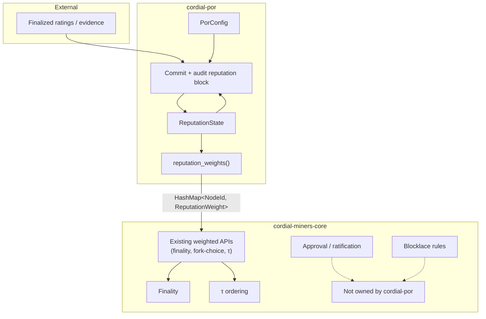
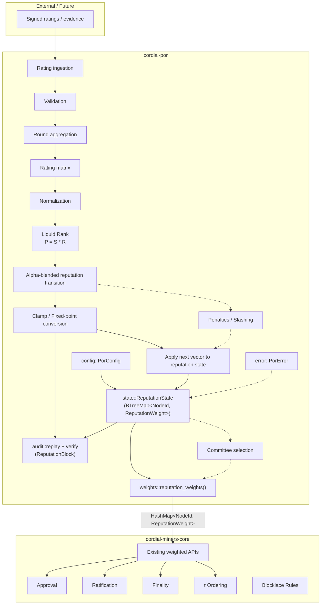

# cordial-por Architecture

## Purpose

`cordial-por` is the dedicated crate for Proof-of-Reputation (PoR) state, deterministic transition audit, and reputation-derived weights that feed the weighted path of Cordial Miners.

Cordial Miners approval, ratification, finality, τ-ordering and blocklace consensus rules remain exclusively inside `cordial-miners-core`.
`cordial-por` computes and exports weights only; it never implements consensus.

## Design Goals

- Keep reputation state and weight export behind a clean crate boundary.
- Supply `HashMap<NodeId, u64>` (aliased as `ReputationWeight`) that the existing weighted APIs of `cordial-miners-core` can consume without modification.
- Remain a pure library; no networking, no block production, no finality logic.
- Provide a stable scaffold for PoR calculation stages while keeping state mutation, publication, and consensus selection separate.

## Related Specifications

- [`data-structures.md`](./data-structures.md): paper-aligned PoR data structures and calculation pipeline.
- [`01-tiered-slashing-and-key-ejection.md`](./01-tiered-slashing-and-key-ejection.md): slashing, inactivity, and permanent key ejection policy.
- [`02-interaction-model-and-rating-policy.md`](./02-interaction-model-and-rating-policy.md): interaction model and rating admission policy.

## High-Level Architecture



## Internal PoR Architecture

The crate implements the deterministic rating-to-reputation path and keeps publication, penalties, and committee selection as explicit extension points.



### Implemented And Future PoR Stages

> **Implementation Note:**  
> The solid edges are implemented. Dotted edges remain future extensions described by the paper (arXiv:2108.03542 and related Liquid-Rank literature). The implemented transition requires consecutive rounds and resolves sparse node sets through a configured no-rating fallback policy. Reputation-block construction derives canonical commitments and audit replay verifies them, but these stages do not publish blocks.

Implemented:

- Rating validation and deterministic round batching
- Rating matrix construction
- Paper-guided rating normalization
- Liquid-Rank contribution calculation
- Alpha-blended reputation transition
- Deterministic sigmoid clamping
- Reputation state application
- Versioned reputation-block construction and canonical commitments
- Reputation transition and commitment audit replay

Future:

- Penalties / slashing
- Reputation block publication
- Committee selection

## Module Responsibilities

| Module | Responsibility | Inputs | Outputs | Dependencies | Public interfaces |
|--------|----------------|--------|---------|--------------|-------------------|
| `config` | Holds fixed-point scale, initial reputation, and the no-rating fallback policy | scale, initial value, policy | `PorConfig`, `MissingEntryPolicy` | `types` | `PorConfig::{new, default}`, `MissingEntryPolicy` |
| `types` | Deterministic PoR data model | — | ratings, matrices, reputation entries, blocks | `cordial-miners-core::NodeId` | re-exported types |
| `ratings` | Validate signed rating records and build deterministic round batches | `RatingRecord`, `PorConfig` | `RatingBatch` | `config`, `types`, `error` | `validate_rating`, `build_rating_batch` |
| `matrix` | Build canonical matrix representation from validated batches | `RatingBatch` | `RatingMatrix` | `types`, `error` | `build_rating_matrix` |
| `normalization` | Apply Section 4.2 modified normalization per recipient row | `RatingMatrix`, `PorConfig` | `NormalizedRatingMatrix` | `config`, `types`, `error` | `normalize_rating_matrix` |
| `liquid_rank` | Compute paper-guided contribution vector `P = S * R` | `NormalizedRatingMatrix`, previous `ReputationVector`, `PorConfig` | contribution `ReputationVector` | `config`, `types`, `error` | `compute_liquid_rank_contribution` |
| `transition` | Blend contribution with previous reputation using checked fixed-point arithmetic and consecutive rounds, resolving sparse node sets through the configured policy | contribution `ReputationVector`, previous `ReputationVector`, `PorConfig` | next-round `ReputationVector` | `config`, `types`, `error` | `blend_reputation_transition` |
| `clamp` | Apply deterministic fixed-point sigmoid clamp to reputation values; the pipeline clamp restores CarryForward entries from previous reputation so an already-finalized value is not decayed and a hand-built blend cannot preserve an arbitrary unclamped value | `ReputationVector`, previous and contribution vectors, `PorConfig` | clamped `ReputationVector` | `config`, `types`, `error` | `clamp_reputation_value`, `clamp_reputation_vector`, `clamp_reputation_transition` |
| `state` | In-memory reputation snapshot keyed by `NodeId`; consumes finalized vectors or audited blocks atomically | round, validator → weight, finalized `ReputationVector` or ratings + `ReputationBlock` | `ReputationState` | `audit`, `config`, `types`, `error` | `new`, `round`, `reputation_list`, `pending_ratings`, `latest_block`, `add_rating`, `set_reputation`, `eject_validator`, `is_ejected`, `excluded_keys`, `apply_reputation_vector`, `apply_reputation_block` |
| `commitments` | Define the canonical, domain-separated v1 commitments for configuration, signed ratings, reputation lists, and reputation blocks | protocol data | Blake2b-256 commitments | `config`, `ratings`, `types`, `error` | `config_commitment`, `rating_batch_commitment`, `reputation_list_commitment`, `reputation_block_hash` |
| `block` | Derive and validate a versioned, shard-bound, finalized-wave-bound reputation block | `ReputationBlockContext`, `RatingBatch`, `ReputationList`, `PorConfig` | `ReputationBlock` | `commitments`, `ratings`, `types`, `error` | `build_reputation_block`, `validate_reputation_block` |
| `audit` | Replay the deterministic transition and verify it, its commitments, and its chain context against a proposed reputation block | previous `ReputationVector`, `&[RatingRecord]`, `ReputationBlock`, `ReputationBlockContext`, `PorConfig` | expected `ReputationList` / verification result | `commitments`, `ratings`, `matrix`, `normalization`, `liquid_rank`, `transition`, `clamp`, `block`, `types`, `error` | `replay_reputation_transition`, `verify_reputation_transition` |
| `weights` | Export current reputation map for the weighted path | `&ReputationState` | `HashMap<NodeId, ReputationWeight>` | `state`, `cordial-miners-core::NodeId` | `reputation_weights` |
| `error` | PoR validation, matrix, normalization, and calculation errors | — | `PorError` | none | `PorError` variants |
| `lib` | Crate root, re-exports | — | public API surface | all of the above | `PorConfig`, `PorError`, `ReputationState`, rating/matrix/liquid-rank/transition/block APIs, types, `reputation_weights` |

## Data Flow

1. A `PorConfig` is created (defaults: scale = `1_000_000_000`, initial_reputation = `200_000_000`).
2. Rating records are validated and batched with `build_rating_batch`.
3. A deterministic `RatingMatrix` is built with `build_rating_matrix`.
4. The matrix is normalized per recipient with `normalize_rating_matrix`.
5. The Liquid-Rank contribution vector is computed with `compute_liquid_rank_contribution`.
6. The next vector is computed with `blend_reputation_transition`, which requires consecutive rounds and covers the union of both node sets, resolving nodes missing from either side through `PorConfig::missing_entry_policy`; this is a pure calculation and does not mutate state.
7. The next vector is clamped with `clamp_reputation_transition`, which applies the sigmoid to rated and newly seeded nodes and restores CarryForward entries from previous reputation. The previous value is copied rather than taken from the blend, so a hand-built blended vector cannot preserve an arbitrary unclamped value. The sigmoid is not idempotent, so clamping those entries would decay them every sparse round. This is a pure calculation and does not mutate state.
8. A finalized vector can be applied directly with `ReputationState::apply_reputation_vector`, or a proposed block can be replay-audited and applied atomically with `ReputationState::apply_reputation_block`. Successful block application also records `latest_block`; failure leaves the prior state unchanged.
9. A `ReputationBlock` is assembled with `build_reputation_block`. The builder accepts finalized protocol inputs rather than caller-supplied hashes and derives the canonical configuration, signed-rating, reputation-list, and previous-block commitments. The v1 header binds the result to a shard and to the finalized wave that opens its reputation round.
10. Any validator can replay steps 2-7 with `replay_reputation_transition` and check a proposed block with `verify_reputation_transition`. Verification checks the header version, shard, source wave, previous-block link, all derived commitments, exclusion flags, and the replayed reputation list. Both operations are read-only.
11. The f1r3node adapter consumes a deterministically closed rating round, constructs and audits its reputation block against a cloned state, exports `reputation_weights`, and replaces the live state only after all fallible work succeeds.
12. Block publication and consensus selection remain future stages.

## Adapter Finalization Boundary

`PorRatingRoundCoordinator::into_completed` converts a closed lifecycle coordinator into an owned `CompletedPorRatingRound`. Open coordinators are rejected, so this handoff cannot bypass quorum or the finalized-wave cutoff. Owning the result also releases the coordinator's immutable borrow of the previous reputation state.

The adapter's `apply_completed_reputation_round` function then performs the complete local transition:

```text
Completed RatingBatch
  -> deterministic replay
  -> ReputationBlock construction
  -> audit replay
  -> ReputationState application
  -> Cordial weight export
```

The transition is atomic with respect to `ReputationState`: all work is staged on a clone and the caller's state is replaced only on success. Its external chain input is the shard identifier. The finalized source wave and canonical rating batch come from `CompletedPorRatingRound`, while the previous reputation block comes from `ReputationState::latest_block`. `cordial-por` derives every commitment internally, so the adapter cannot inject opaque commitment bytes.

## Ownership Boundaries

### cordial-por owns

- Reputation state representation (`ReputationState`).
- Fixed-point scale and initial-reputation configuration.
- Rating validation, deterministic matrix construction, paper-guided rating normalization, Liquid-Rank contribution calculation, pure alpha-blend transition calculation with a configured no-rating fallback, deterministic sigmoid clamping (restoring CarryForward entries from previous reputation so finalized reputation is not decayed on a sparse round), explicit finalized-vector application, canonical reputation commitments, atomic audited-block application to `ReputationState`, reputation-block construction and validation, and deterministic audit replay of a proposed reputation block.
- Conversion of the current reputation map into the weight map expected by Cordial Miners.
- Future PoR algorithms (penalties and selection) once implemented.

### cordial-por does NOT own

- Approval mechanics
- Ratification
- Finality detection
- τ ordering
- Blocklace consensus rules
- Equivocation detection / exclusion
- Networking or block production

## Integration Contract

**Current implemented interface**

```rust
pub fn reputation_weights(state: &ReputationState) -> HashMap<NodeId, ReputationWeight>
```

where `ReputationWeight = u64` and `NodeId` is the type defined by `cordial-miners-core`.

**Intended integration contract** (already satisfied by the current function)

- `cordial-por` exports `HashMap<NodeId, u64>`.
- `cordial-miners-core` consumes those weights through its existing weighted APIs (finality stake summation, fork-choice scoring, etc.).
- No consensus behaviour is altered; weights are only an input parameter.
- Refresh / update lifecycle is currently caller-driven (`set_reputation` + re-export). Persistence ownership remains outside the crate.
- Adapter layer is trivial: the returned map is already in the form expected by the weighted path.

## Relationship with Cordial Miners Consensus

`cordial-por` computes weights.

It does **not** implement:

- consensus
- approval
- ratification
- τ ordering
- finality
- blocklace rules

All of the above remain the exclusive responsibility of `cordial-miners-core`. The only coupling is the consumption of the weight map.

## Open Design Decisions

### All-validator reputation weights vs committee weights

- **Current implementation:** All validators present in `ReputationState` are exported.
- **Paper design:** Highest-reputation nodes form a consensus committee.
- **Future work:** Policy flag (reputation-only / committee-only / stake × reputation) inside the weight exporter.

### >2/3 finality threshold vs >50% committee threshold

- **Current implementation:** Threshold logic lives entirely in `cordial-miners-core` (supermajority of honest stake).
- **Paper design:** Committee of high-reputation nodes may use a lower internal threshold.
- **Future work:** Decide whether PoR only supplies weights or also influences the threshold constant.

### Fixed-point scale

- **Current implementation:** `PorConfig::DEFAULT_SCALE = 1_000_000_000`.
- **Paper design:** Liquid Rank produces real-valued ranks that must be scaled for integer arithmetic.
- **Current clamp policy:** Deterministic fixed-point clamping uses integer square root, rejects zero scale, and reports checked arithmetic overflow as `PorError::ClampOverflow`.

### Reputation sidechain vs payload references

- **Current implementation:** Reputation blocks can be assembled locally from finalized reputation lists and audited by replaying their round, but there is no sidechain publication or storage yet.
- **Paper design:** Reputation updates may be carried as a sidechain or as payload references inside the main blocklace.
- **Future work:** Choose the audit / publication path and the corresponding storage/replay structures.

## Future Extensions

Logical extension points that do not yet exist:

- Penalty / slashing application that mutates `ReputationState`.
- Reputation-block publication, storage, and a persisted audit trail.
- Committee selection policy that filters the exported weight map.
- Persistence layer (snapshot / restore of `ReputationState`).
- Configuration-driven weight policies (reputation-only, stake-times-reputation, capped stake, committee-only).

None of the above are present in the current scaffold; they are documented solely as planned extension points.
