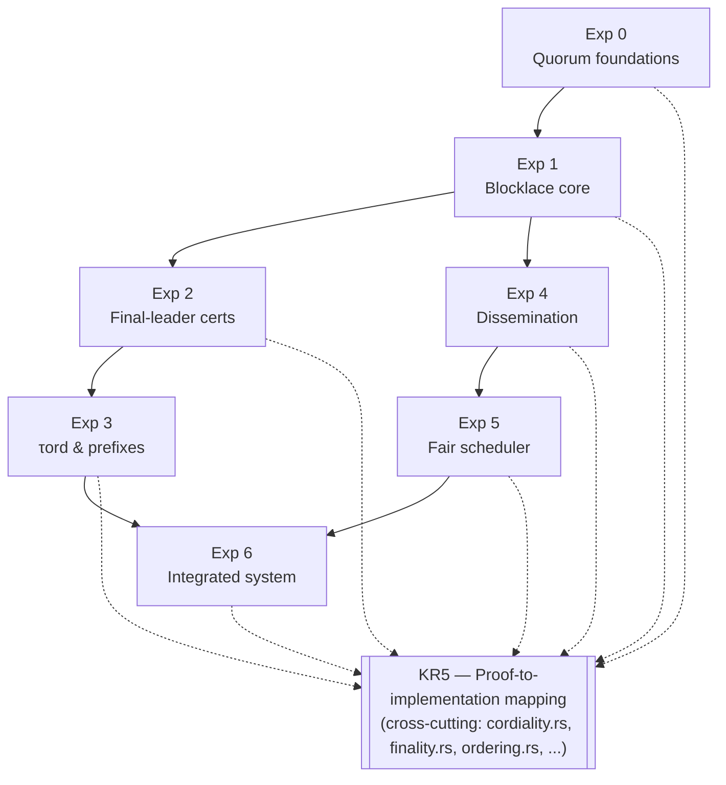

# Design Layout (CMSpec + CMRef)

Architectural layout of the experiment series.

- **CMSpec** — abstract relational specification (Lean definitions + theorem statements). Describes *what must be true*.
- **CMRef** — executable Lean reference model. Implements the algorithms so that small examples can be executed and the CMSpec statements can be proved (or explicitly assumed).

## Table of Contents

1. [Global Architecture](#1-global-architecture)
2. [Experiment 0 – Weighted Quorum & Threshold Foundations](#2-experiment-0--weighted-quorum--threshold-foundations)
3. [Experiment 1 – Blocklace Validation & Equivocation](#3-experiment-1--blocklace-validation--equivocation)
4. [Experiment 2 – Final-Leader Certificates](#4-experiment-2--final-leader-certificates)
5. [Experiment 3 – Deterministic τord and Prefix Proofs](#5-experiment-3--deterministic-τord-and-prefix-proofs)
6. [Experiment 4 – Dissemination & Priority Dissemination](#6-experiment-4--dissemination--priority-dissemination)
7. [Experiment 5 – Fair Multi-Wave Scheduler](#7-experiment-5--fair-multi-wave-scheduler)
8. [Experiment 6 – Integrated System](#8-experiment-6--integrated-system)
9. [Proof-to-Implementation Mapping (KR5)](#9-proof-to-implementation-mapping-kr5)
10. [Experiment Summary Table](#experiment-summary-table)
11. [Architecture Diagram](#11-architecture-diagram)


---

## 1. Global Architecture

- All theorems live in **CMSpec**.
- All algorithms that are proved to satisfy those theorems live in **CMRef**.
- Later experiments may depend only on the **CMSpec interfaces** of earlier experiments (not on internal CMRef details).
- Trusted boundaries and assumptions are recorded explicitly in the theorem registry.

```
CMSpec (relational contracts)
        │
        │ refinement / implementation
        ▼
CMRef (executable algorithms)
```

---

## 2. Experiment 0 – Weighted Quorum & Threshold Foundations

### CMSpec (relational)

**Purpose.** Establishes the trust-model foundations that every later certificate, leader-safety, and integration theorem is stated relative to.

**Scope.** The experiment should define:

- the validator set and a weight function over validators;
- the assumed Byzantine fault threshold (bound on adversarial weight);
- weighted quorum thresholds (e.g. the weight fraction required for a valid quorum);
- weighted approval as a predicate over sets of validator signatures/votes.

**Theorem family:**

- `byzantine_threshold_assumption`
- `quorum_intersection`
- `weighted_quorum_nonempty`
- `quorum_weight_monotone`
- `weighted_approval_implies_quorum`

### CMRef (executable)

- Reference validator/weight registry.
- Functions: `validatorWeight`, `totalWeight`, `isQuorum`, `quorumIntersect`, `checkByzantineBound`, `weightedApproval`.

---

## 3. Experiment 1 – Blocklace Validation & Equivocation

### CMSpec (relational)

**Purpose.** Introduces the blocklace layer: signed blocks, parent pointers, finite closed DAGs, observation by reachability, buffering of dangling blocks, and equivocation detection. This is where the implementation stops being merely a finality kernel and becomes a Cordial Miners implementation.

**Scope.** The experiment should define:

- validator identities and block records with creator, round, wave, parent hashes, payloads, hash, and signature;
- a finite accepted blocklace for each node;
- a buffer for blocks whose parents are missing;
- observation `ObservesL(b, c)` as the transitive closure of predecessor/parent links;
- block conflict for same creator and same slot with different hash;
- equivocation evidence and exclusion/slashing facts.

**Theorem family:**

- `insert_preserves_parent_closure`
- `insert_preserves_acyclicity`
- `accepted_blocks_are_valid`
- `buffered_blocks_not_in_blocklace`
- `resolve_buffer_sound`
- `equivocation_evidence_sound`
- `exclusion_persistent`
- `honest_chain_linear_order`
- `equivocator_exclusion_sound`

### CMRef (executable)

- Reference blocklace store + buffer.
- Functions: `receiveBlock`, `insertBlock`, `resolveBuffer`, `detectConflict`, `produceExclusionEvidence`, `observes`, `isParentClosed`, `isAcyclic`.

---

## 4. Experiment 2 – Final-Leader Certificates

### CMSpec (relational)

**Purpose.** Builds the leader-selection and certification layer on top of the blocklace: a deterministic leader policy, the notion of a block being "approved" by an anchor, and the escalating certificate types (ratification → super-ratification → final-leader) that later experiments treat as trusted inputs.

**Scope.**

- Leader selection / deterministic leader policy.
- Block approval (anchor observes block and does not observe a conflicting equivocation).
- `RatCert`, `SuperRatCert`, `FLCert`.

**Theorem family:**

- `rat_cert_sound`
- `super_rat_cert_sound`
- `fl_cert_sound`
- `fl_cert_persistent_under_extension`
- `fl_cert_uses_fixed_snapshot`
- `fl_cert_no_conflicting_finalization`
- `fl_cert_monotone_append_only` 
- `Leader_equivocation_detected`
- `supermajority_intersection_for_leaders`

### CMRef (executable)

- Reference final-leader detector.
- Functions: `selectLeader`, `isBlockApproved`, `addRatification`, `ratificationReached`, `emitRatCert`, `emitSuperRatCert`, `emitFLCert`, `leaderEquivocationDetected`.

---

## 5. Experiment 3 – Deterministic τord and Prefix Proofs

### CMSpec (relational)

**Purpose.** Specifies τord as a pure deterministic ordering function from a finite closed blocklace snapshot and certificate database to an ordered prefix. The human goal is to separate the meaning of ordering from the scheduling and networking code that eventually triggers it.

**Scope.** The experiment introduces:

- canonical total ordering of candidate leaders and block hashes;
- `lastFinalLeader`;
- `previousRatifiedLeader`;
- deterministic `xsort`, a canonical topological sort filtered by anchor approval;
- the recursive definition of τord;
- a cached implementation and cache invariant.

**Theorem family:**

- `tau_ord_total`
- `tau_ord_deterministic`
- `xsort_topological`
- `xsort_no_duplicates`
- `tau_ord_output_valid`
- `tau_ord_cache_correct`
- `tau_ord_prefix_monotone_under_leader_safety` — *conditional on leader safety: holds only while no undetected leader equivocation exists within the compared snapshots.*
- `tau_ord_prefix_consistency`
- `tau_ord_liveness_under_leader_liveness` — *conditional on leader liveness: holds only while leaders continue to be selected and certified without indefinite stalling.*

### CMRef (executable)

- Pure from-scratch reference implementation of τord.
- Cached implementation + cache invariant proved equivalent to the pure version.
- Functions: `lastFinalLeader`, `previousRatifiedLeader`, `xsort`, `tauOrdPure`, `tauOrdCached`, `cacheLookup`, `cacheUpdate`, `isPrefixExtension`, `outputPrefix`.

---

## 6. Experiment 4 – Dissemination & Priority Dissemination

### CMSpec (relational)

**Purpose.** Adds the network-facing blocklace dissemination layer. It first implements a safe baseline dissemination skeleton and then adds priority heuristics with an explicit non-starving fairness lane. Priority is an optimization; the fairness lane is the correctness mechanism.

**Scope.**

- local knowledge estimates `KnownEst[i,j]`;
- packages containing blocks the receiver may lack;
- package validation;
- buffering for missing parents;
- repair requests and repair responses;
- append-only send, receive, insert, reject, and repair logs.

Priority dissemination should add:

- block scores for dependency repair, final-leader relevance, τord frontier relevance, cordiality relevance, age, and creator weight;
- peer scores for backlog, repair need, delivery quality, and fairness debt;
- a two-lane scheduler with `Kfair ≥ 1`;
- bounded package sizes and parent-first package construction;
- priority-decision audit logs.

**Theorem family:**

- `dissemination_preserves_blocklace_validity`
- `dissemination_insert_sound`
- `known_estimate_sound`
- `fair_lane_block_non_starvation`
- `peer_non_starvation`
- `priority_dissemination_completeness`
- `bounded_fair_lane_delay`

### CMRef (executable)

- Reference dissemination engine.
- Explicit two-lane policy (priority lane + fairness lane with `Kfair ≥ 1`).
- Priority scores are parameters; the fairness lane is the verified correctness mechanism.
- Functions: `updateKnownEst`, `buildPackage`, `validatePackage`, `sendPackage`, `receivePackage`, `requestRepair`, `respondRepair`, `priorityScore`, `fairLaneSelect`, `dispatchPackage`.

---

## 7. Experiment 5 – Fair Multi-Wave Scheduler

### CMSpec (relational)

**Purpose.** Specifies a fair scheduler that arbitrates CPU/IO budget across concurrently active waves, guaranteeing that every runnable wave and every persistent bounded task is served, so that the dissemination, final-leader, and τord layers defined in earlier experiments all keep making progress under a single resource-constrained scheduling policy.

**Scope.**

- Finite active-wave registry, wave-local task queues, immutable snapshots.
- Bounded task costs, class quotas, deficit/fairness accounting.
- Output-prefix safety.

**Theorem family:**

- `admissible_scheduler_deterministic`
- `wave_non_starvation`
- `bounded_wave_service`
- `persistent_task_completion`
- `scheduled_dissemination_completeness`
- `scheduled_fl_cert_completion`
- `scheduled_tau_ord_completion`
- `output_prefix_safety`
- `scheduler_refines_tfine`

### CMRef (executable)

- Reference scheduler with budget clock, wave registry, task dispatch, and prefix checks.
- Guarantees every continuously runnable wave is scheduled infinitely often (abstract model) and every persistent bounded task eventually completes.
- Functions: `registerWave`, `enqueueTask`, `allocateBudget`, `selectNextTask`, `runSlice`, `updateDeficit`, `checkClassQuota`, `emitOutputPrefix`, `schedulerStep`.

---

## 8. Experiment 6 – Integrated System

### CMSpec (relational – top-level)

**Purpose.** Composes the module contracts from every earlier experiment into a single end-to-end system and restates their guarantees as conditional, top-level theorems — conditional because the integrated safety and liveness results only hold under the union of the per-module assumptions (e.g. Byzantine thresholds, leader safety/liveness) rather than being proved unconditionally at this level.

**Composition of previous module contracts.** Integration depends only on the **CMSpec interfaces** of:

- **Experiment 0** — validator weights, Byzantine threshold assumption, quorum intersection.
- **Experiment 1** — blocklace validity, observation, equivocation/exclusion facts.
- **Experiment 2** — leader selection, block approval, `RatCert` / `SuperRatCert` / `FLCert`.
- **Experiment 3** — deterministic τord and prefix-validity guarantees.
- **Experiment 4** — dissemination validity and fairness (non-starvation) guarantees.
- **Experiment 5** — scheduler fairness and output-prefix safety.

**Conditional end-to-end theorems:**

- `integrated_safety` — *conditional on the Byzantine fault threshold assumed in Experiment 0 holding.*
- `integrated_prefix_consistency` — *conditional on τord prefix consistency (Experiment 3) and scheduler output-prefix safety (Experiment 5) both holding.*
- `integrated_threshold_finality_safety` — *conditional on the finality-kernel threshold-certificate soundness assumed in Experiment 0.*
- `integrated_scheduled_progress` — *conditional on scheduler non-starvation (Experiment 5) and dissemination fairness (Experiment 4).*
- `integrated_tau_liveness_under_leader_live` — *conditional on leader liveness, as in `tau_ord_liveness_under_leader_liveness` (Experiment 3).*

### CMRef (executable)

- Single integrated reference model that wires together the CMRef modules of Experiments 0–5.
- Realises the composition under the same assumptions that appear in the CMSpec statements.
- Functions: `nodeStep`, `networkDeliver`, `runQuorumCollector`, `runBlocklace`, `runFinalLeader`, `runTauOrd`, `runDissemination`, `runScheduler`, `integratedStep`, `checkSafetyInvariants`.

---

## 9. Proof-to-Implementation Mapping

**Purpose.** Connect Proofs to Executable Checks. This is a cross-cutting layer, not a numbered experiment: for every Lean theorem above, it records which Rust module the corresponding executable logic lives in and which test concept is expected to exercise it. This keeps the formal statements aligned with the implementation as both evolve.

**Scope.**

- A mapping from each CMSpec theorem (or theorem family) to the Rust implementation file(s) it constrains.
- A proof-to-test checklist: for every safety property proved in Lean, a named Rust test concept that a reviewer can check exists and passes.
- A process for flagging drift (a Lean theorem changes but the mapped Rust file/test doesn't, or vice versa).

**Indicative mapping:**

| CMSpec theorem family | Implementation file | Rust test concept |
|---|---|---|
| `insert_preserves_parent_closure`, `insert_preserves_acyclicity`, `equivocation_evidence_sound`, `exclusion_persistent`, `honest_chain_linear_order`, `equivocator_exclusion_sound` | `cordiality.rs` | equivocation-detection and DAG-closure tests |
| `byzantine_threshold_assumption`, `quorum_intersection`, `weighted_quorum_nonempty` | shared/quorum module referenced by `finality.rs` | quorum-intersection and threshold-bound tests |
| `rat_cert_sound`, `super_rat_cert_sound`, `fl_cert_sound`, `fl_cert_no_conflicting_finalization`, `fl_cert_monotone_append_only` | `finality.rs` | leader-finality-safety and certificate-escalation tests |
| `tau_ord_deterministic`, `xsort_topological`, `tau_ord_output_valid`, `tau_ord_prefix_consistency` | `ordering.rs` | deterministic-ordering and prefix-consistency tests |
| `dissemination_preserves_blocklace_validity`, `fair_lane_block_non_starvation`, `bounded_fair_lane_delay` | dissemination module | non-starvation and bounded-delay tests |
| `wave_non_starvation`, `output_prefix_safety`, `scheduler_refines_tfine` | scheduler module | fairness and prefix-safety tests |
| `integrated_safety`, `integrated_prefix_consistency`, `integrated_threshold_finality_safety` | integration/top-level module | end-to-end safety regression tests |

### CMRef / tooling

- A machine-checkable checklist (one row per CMSpec theorem) linking Lean predicate name → implementation file → test identifier.
- Deliverable: a standalone **proof-to-implementation mapping document**, kept alongside the Lean project and updated whenever a theorem or its corresponding Rust file changes.

---

## Experiment Summary Table

| # | Experiment | Theorems | Conditional | Key CMRef Functions |
|---|---|---|---|---|
| 0 | Weighted Quorum & Threshold Foundations | 5 | 1 | `isQuorum`, `quorumIntersect`, `checkByzantineBound` |
| 1 | Blocklace Validation & Equivocation | 9 | 0 | `insertBlock`, `detectConflict`, `observes` |
| 2 | Final-Leader Certificates | 9 | 0 | `selectLeader`, `emitFLCert` |
| 3 | Deterministic τord & Prefix Proofs | 9 | 2 | `xsort`, `tauOrdPure`, `tauOrdCached` |
| 4 | Dissemination & Priority Dissemination | 7 | 0 | `buildPackage`, `fairLaneSelect` |
| 5 | Fair Multi-Wave Scheduler | 9 | 0 | `schedulerStep`, `selectNextTask` |
| 6 | Integrated System | 5 | 5 (all) | `integratedStep`, `checkSafetyInvariants` |
| — | Proof-to-Implementation Mapping | n/a (checklist) | n/a | mapping/checklist document |

---


## 11. Architecture Diagram

Dependency flow across the experiment series: Experiment 0 grounds Experiment 1, which splits into Experiment 2 and Experiment 4, each feeding one downstream layer (Experiment 3 and Experiment 5 respectively), both of which converge into Experiment 6. The Proof-to-Implementation Mapping (KR5) is cross-cutting and applies to every experiment above it rather than sitting in the dependency chain.



**Legend.**

- Solid arrows — CMSpec dependency (later experiment consumes only the CMSpec interface of the earlier one).
- Dashed arrows — coverage by the cross-cutting KR5 proof-to-implementation mapping, which applies to every experiment.
- Experiment 0 (foundation): validator weights, Byzantine threshold, quorum intersection.
- Experiments 1–3 (core protocol correctness): blocklace validity, leader certification, deterministic ordering.
- Experiments 4–5 (networking and scheduling): dissemination fairness, scheduler fairness.
- Experiment 6 (integration): conditional end-to-end theorems composing all of the above.

---